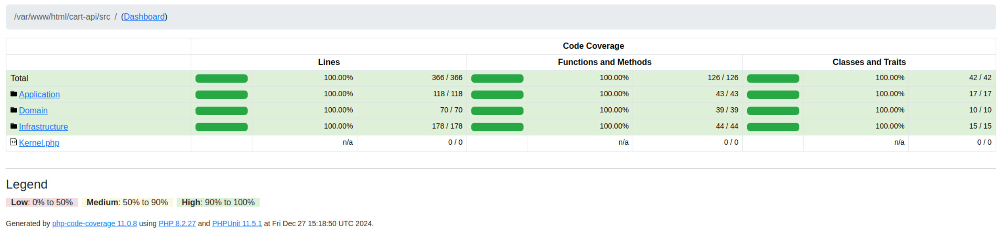

# 🛒 Code Challenge - API para Carrito de Compras

Este proyecto es el resultado de una prueba técnica cuyo objetivo es diseñar e implementar una API para gestionar un carrito de compras. La API será consumida posteriormente por una interfaz de usuario, permitiendo a los usuarios añadir, actualizar y eliminar productos, obtener el total de productos en el carrito y confirmar su compra.

El desarrollo de esta solución se ha realizado con un enfoque en **tecnologías modernas**, utilizando **Arquitectura Hexagonal** y principios de **Domain-Driven Design (DDD)** para garantizar un código limpio, mantenible y desacoplado. Además, se ha dado prioridad a la **simplicidad**, **performance** y una **alta cobertura de pruebas** para validar los casos de uso clave.

## 📋 Enunciado de la prueba

La prueba técnica consistió en desarrollar una API que permita gestionar el carrito de compras de una plataforma de e-commerce. Los principales requisitos eran los siguientes:

### ✅ Requerimientos
1. **Gestión de productos del carrito**:
    - Añadir productos.
    - Actualizar productos existentes.
    - Eliminar productos.

2. **Operaciones del carrito**:
    - Obtener el número total de productos.
    - Confirmar la compra.

### 🎯 Aspectos valorados
- Código limpio, simple y fácil de entender.
- Uso de **Arquitectura Hexagonal** y **Domain-Driven Design**.
- Máxima cobertura de pruebas unitarias.
- Balance entre **performance** y **mantenibilidad**.
- Independencia del framework en el diseño del dominio.

## 🚀 Cómo comenzar

Para empezar a trabajar con este proyecto, puedes usar Docker para levantar todos los servicios necesarios de forma rápida y sencilla. A continuación, se describen los pasos para ejecutar el proyecto en tu máquina local.

### 🐳 Requisitos previos
Asegúrate de tener instalados los siguientes programas en tu máquina:

- [Docker](https://www.docker.com/get-started)
- [Docker Compose](https://docs.docker.com/compose/install/)

### 🖥️ Ejecutar el proyecto

1. Clona este repositorio en tu máquina local:
2. En el directorio raíz del proyecto, ejecuta el siguiente comando para levantar los servicios usando Docker Compose:
    ```bash
    docker-compose up --build
    ```

   Este comando descargará las imágenes necesarias y levantará los contenedores definidos en el archivo `docker-compose.yml`.

3. Una vez que los contenedores estén en funcionamiento, la API estará disponible en el puerto configurado (por defecto `localhost:8000`). 
4. Crear la base de datos ejecutando:
    ```bash
    make create-database
    ```
5. Para aplicar las migraciones y actualizar la base de datos, ejecuta:
    ```bash
    make execute-migrations
    ```
En el Make file encontrarás otros comandos que te pueden ser de utilidad como entrar al docker, crear migraciones, entre otros

### ⚙️ Detener los servicios

Para detener los contenedores y liberar los recursos, ejecuta el siguiente comando:
```bash
docker-compose down
```

## 📡 API Endpoints

Para facilitar las pruebas y la interacción con los diferentes endpoints de la API, se ha incluido un archivo de colección de HTTP llamado `cart-api/http-collection.http`. Este archivo contiene las solicitudes necesarias para interactuar con la API y realizar las operaciones sobre el carrito de compras.

A continuación se detallan los endpoints disponibles, los cuales puedes probar directamente desde el archivo:

### 🛒 **Create Cart**
- **Método**: `POST`
- **URL**: `http://localhost:8000/api/v1/cart/create`
- **Body**:
    ```json
    {
      "session_id": "cc36d863-d297-4baa-a52e-137c8d494340",
      "user_id": "5588958d-74e0-4370-9c76-176212138a67"
    }
    ```

### 🏷️ **Create Product**
- **Método**: `POST`
- **URL**: `http://localhost:8000/api/v1/product/create`
- **Body**:
    ```json
    {
      "product_reference": "P000036",
      "name": "Sun glasses"
    }
    ```

### ➕ **Add to Cart**
- **Método**: `POST`
- **URL**: `http://localhost:8000/api/v1/cart/add-to`
- **Body**:
    ```json
    {
      "cart_id": "d0a86f87-5e6a-4bff-97e1-e76c12eaf814",
      "product_reference": "P000036",
      "quantity": 6
    }
    ```

### ➖ **Remove from Cart**
- **Método**: `POST`
- **URL**: `http://localhost:8000/api/v1/cart/remove-from`
- **Body**:
    ```json
    {
      "cart_id": "d0a86f87-5e6a-4bff-97e1-e76c12eaf814",
      "product_reference": "P000036",
      "quantity": 3
    }
    ```

### 📊 **Cart Product Count**
- **Método**: `POST`
- **URL**: `http://localhost:8000/api/v1/cart/product-units-count`
- **Body**:
    ```json
    {
      "cart_id": "d0a86f87-5e6a-4bff-97e1-e76c12eaf814"
    }
    ```

### 💳 **Cart Purchase**
- **Método**: `POST`
- **URL**: `http://localhost:8000/api/v1/cart/purchase`
- **Body**:
    ```json
    {
      "cart_id": "d0a86f87-5e6a-4bff-97e1-e76c12eaf814"
    }
    ```

### 📝 Cómo probar los endpoints

Puedes abrir el archivo `cart-api/http-collection.http` con un editor de texto o una herramienta compatible con colecciones HTTP (como [Postman](https://www.postman.com/) o el porpio IDE PhpStorm) para realizar las peticiones directamente desde allí.


Aquí tienes el apartado que explica cómo ejecutar los tests y acceder al informe de cobertura:

markdown
Copiar código
## 🧪 Pruebas y Cobertura

Este proyecto incluye una suite de pruebas automatizadas para asegurar que el código funciona correctamente. Además, la cobertura de las pruebas es del **100%**

